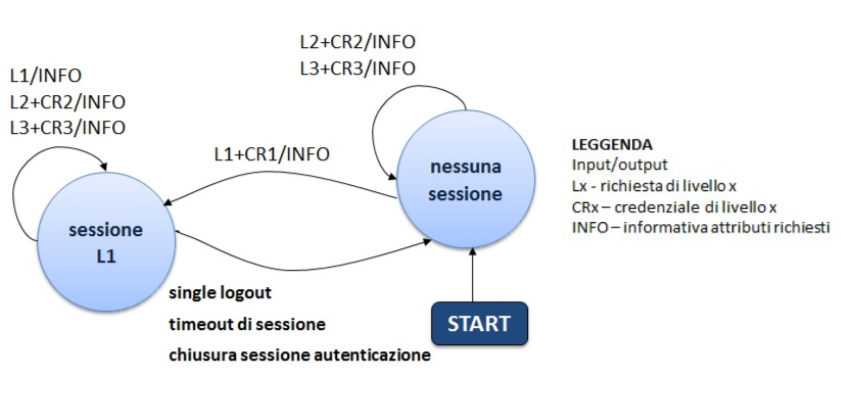

Single Logout
=============

Gestione delle sessioni
-----------------------

Ai sensi dell’art 28 del regolamento *Modalità attuative per la realizzazione dello SPID* un gestore delle identità a completamento con esito positivo dell’autenticazione relativa al livello SPID 1 di un utente stabilisce per lo stesso utente una sessione finalizzata al processo di autenticazione. Nel corso di validità della sessione instaurata, il gestore delle identità può rilasciare ai fornitori di servizi, che fanno richiesta di autenticazione di livello SPID 1 per l’utente con il quale è stata stabilita la sessione, asserzioni di autenticazione basate sull’evento di autenticazione che ha dato origine alla sessione stessa.
Ancora a i sensi dell’art 28 del regolamento *Modalità attuative per la realizzazione dello SPID*, per le richieste di autenticazione di livello SPID 2 e 3 non è prevista l’instaurazione di alcuna sessione, pertanto per ogni richiesta di questo tipo deve essere ripetuto l’evento di autenticazione.
La sessione stabilita a seguito di un evento di autenticazione relativo al livello SPID 1 è denominata, per chiarezza di esposizione, **sessione di autenticazione** per distinguerla dalla sessione che un fornitore di servizi può instaurare con l’utente al fine dell’erogazione di un particolare servizio richiesto, denominata a sua volta **sessione individuale**.

La relazione esistente tra la *sessione di autenticazione*, mantenuta dal gestore dell’identità per un dato utente, e le *sessioni individuali* gestite per lo stesso utente dai fornitori di servizi stabilite sullo stesso evento di autenticazione che ha dato origine alla *sessione di autenticazione*, costituisce, in senso logico, una sessione distribuita che denominiamo **sessione globale**.
Il diagramma di stato riportato in figura 1 specifica il comportamento che deve assumere il gestore delle identità per la gestione della *sessione di autenticazione* relativa ad un dato utente a fronte delle diverse richieste che possono essere presentate dai fornitori di servizi relativamente allo stesso utente.

L’evoluzione dello stato associato alla *sessione di autenticazione* deve rispettare le seguenti regole:

a) l’instaurazione di una *sessione di autenticazione* per un determinato utente avviene al completamento con esito positivo di una richiesta di autenticazione di livello SPID 1 da parte di un fornitore di servizi - evento di autenticazione andato a buon fine con contestuale assenso al trasferimento delle informazioni richieste -. Il fornitore di servizi che ha effettuato la richiesta entra a far parte della *sessione globale*;

b) le richieste di autenticazione per i livelli SPID 2 e SPID3 per un dato utente, non devono influenzare il regime di sessione per esso vigente. In particolare, se le richieste dovessero pervenire in presenza di una *sessione di autenticazione* relativa all’utente questa non deve essere in nessun caso chiusa; viceversa, se le richieste dovessero giungere in assenza di una *sessione di autenticazione* relativa all’utente questa non deve essere in nessun caso creata. Il fornitore di servizi che ha effettuato la richiesta non entra a far parte della *sessione globale* relativa all’utente qualora questa esistesse;

c) le richieste di autenticazione di livello SPID1 per un dato utente successive all’instaurazione di una *sessione di autenticazione* per lo stesso utente, qualunque sia il loro esito, non devono incidere sul perdurare della sessione stessa. Il mancato assenso da parte dell’utente al trasferimento delle informazioni richieste dal fornitore di servizi determina il fallimento della richiesta ma non deve produrre conseguenze sulla vigente *sessione di autenticazione* né sulla *sessione globale*; ovvero, in merito a quest’ultima, il mancato assenso non deve comportare:

    * l’esclusione dalla *sessione globale* del fornitore di servizi che opera la richiesta se questo fosse già coinvolto nella stessa *sessione globale* per una precedente richiesta andata a buon fine;
    * l’inclusione nella *sessione globale* del fornitore di servizi nel caso questo non fosse ancora coinvolto nella stessa *sessione globale* per una precedente richiesta andata a buon fine.

    L’assenso da parte dell’utente al trasferimento delle informazioni determina il successo della richiesta ed il coinvolgimento del fornitore di servizi nella *sessione globale* relativa all’utente, se lo stesso fornitore di servizi non ne facesse già parte per via di una precedente richiesta da esso effettuata ed andata a buon fine.

d) L’evento di Single Logout consiste nella chiusura della *sessione di autenticazione* e di tutte le *sessioni individuali* messe tra loro in relazione dalla *sessione globale*. Tale chiusura avviene su espressa richiesta dell’utente presso il gestore dell’identità o presso uno dei fornitori di servizi. La modalità prevista in SPID per il processo di Single Logout è quella definita dal SAML Single Logout Profile (cfr.[SAML-profiles] sez. 4.4). L’insieme dei fornitori di servizi che entrano a far parte della *sessione globale*, necessario alla corretta gestione del Single Logout Profile è popolato dinamicamente dal gestore delle identità, applicando i criteri espressi nei precedenti punti a), b, c). Il processo di Single Logout necessita per andare a buon fine del corretto comportamento di tutti i fornitori di servizio coinvolti nella *sessione globale* secondo quanto previsto dal suddetto Single Logout Profile. Se qualcuno di questi fornitori di servizi non rispetta il comportamento previsto dal Single Logout Profile, il processo non potrà essere concluso con successo e il Single Logout sarà perciò degradato a partial logout. Il partial logout, pur non dando garanzia che tutte le *sessioni individuali* vigenti presso i fornitori di servizio coinvolti nella *sessione globale* siano effettivamente chiuse, deve comunque assicurare la chiusura della *sessione di autenticazione* e, qualora la richiesta di Single Logout venga fatta presso un fornitore dei servizi, della *sessione individuale* mantenuta dallo stesso fornitore dei servizi presso cui viene operata la richiesta.

e) La *sessione di autenticazione* può essere chiusa ad opera del gestore dell’identità allo scadere del timeout associato alla sessione stessa o su richiesta operata dall’utente presso lo stesso gestore dell’identità. Con la chiusura della *sessione di autenticazione* viene meno la relazione che lega la *sessione di autenticazione* stessa con le *sessioni individuali* stabilite sulla base di quest’ultima e di conseguenza la *sessione globale* decade. Una eventuale richiesta di Single Logout relativa ad una *sessione globale* in precedenza venuta meno a seguito di una chiusura della *sessione di autenticazione* si risolve in una immediata notifica di partial logout, presentata dal gestore dell’identità al fornitore di servizi presso cui ne è stata fatta richiesta.

I gestori delle identità dovranno mettere a disposizioni dell’utente funzionalità per la richiesta di Single Logout o per la chiusura della *sessione di autenticazione*.

Sessioni individuali
^^^^^^^^^^^^^^^^^^^^

E’ lasciata ai fornitori di servizi la scelta delle modalità da adottare per la gestione del ciclo di vita delle *sessioni individuali*. In particolare le *sessioni individuali* possono:

1. non essere affatto instaurate (il fornitore di servizi eroga il servizio richiesto dall’utente senza, per quanto possibile, stabilire con esso alcuna sessione);
2. essere chiuse anche nel corso di validità della *sessione di autenticazione* che le ha originate (ovvero prima di una eventuale richiesta di Single Logout o della scadenza del timeout associato alla *sessione di autenticazione*).

In entrambi i casi i fornitori di servizio devono essere comunque in condizione di supportare il processo di Single Logout notificando, a fronte della prevista richiesta da parte del gestore delle identità, l’avvenuta chiusura delle sessioni mai instaurate o già in precedenza chiuse. I fornitori di servizio che instaurano *sessioni individuali* dovranno mettere a disposizioni dell’utente funzionalità per la richiesta della chiusura della *sessione individuale* o della *sessione globale*.

Meccanismi di Single Logout
^^^^^^^^^^^^^^^^^^^^^^^^^^^

Per la realizzazione del processo di Single Logout secondo quanto previsto dal SAML Single Logout Profile le entità coinvolte (gestore dell’identità e fornitori di servizi) dovranno mettere a disposizione una apposita interfaccia per la notifica dei messaggi:

* **SingleLogoutService**: ricezione di richieste e notifiche per il Single Logout SAML.

Le tabelle seguenti specificano i passi previsti ed il flusso di messaggi che intercorrono tra il gestore delle identità, l’utente ed i fornitori di servizi nel corso del processo di Single Logout, nei due casi distinti in cui l’inizio avviene presso il gestore dell’identità oppure presso uno dei fornitori di servizi.

.. list-table:: Single Logout iniziato presso un Fornitore di Servizi
    :widths: auto
    :header-rows: 1
    
    * - 
      - Descrizione
      - SAML
      - Binding
    * - 1
      - L’utente utilizzando il browser (User Agent) richiede il Single Logout presso un fornitore di servizi
      - 
      - 
    * - 2
      - Il fornitore di servizi procede con la chiusura della propria sessione individuale ed invia una richiesta
      - LogoutRequest
      - HTTP-Redirect, HTTP-POST
    * - 3
      - Il gestore dell’identità ricevuta la richiesta chiude la sessione di autenticazione associata alla sessione globale. Successivamente per ciascun fornitore di servizi facente parte della sessione globale, a partire da quelli in grado di supportare il bindind SOAP, procede alla chiusura delle sessioni individuali. In particolare:
      - 
      - 
    * - 3.1
      - invia una richiesta di logout all’i- esimo fornitore di servizi riportando l’identificatore associato alla sessione globale che si vuole chiudere
      - LogoutRequest
      - SOAP, HTTP-Redirect, HTTP-POST
    * - 3.2
      - l’i-esimo fornitore di serviziricevuta la richiesta chiude la sessione identificata ( se la stessa non fosse stata già chiusa in precedenza o mai instaurata) ed invia una notifica di avvenuta chiusura al gestore dell’identità
      - LogoutResponse
      - SOAP, HTTP-Redirect, HTTP-POST
    * - 3.3
      - Se l’i-esimo fornitore di servizi non è raggiungibile il processo degrada a partial logout
      - 
      - 
    * - 4
      - Il gestore dell’identità completata la notifica a ciascun fornitore di servizi facente parte della sessione globale trasmette l’esito (success/partial logout) del global logout al fornitore di servizi che aveva dato inizio al processo.
      - LogoutResponse
      - SOAP, HTTP-Redirect, HTTP-POST

.. list-table:: Single Logout avente origine presso il gestore dell'identità
    :widths: auto
    :header-rows: 1
    
    * - 
      - Descrizione
      - SAML
      - Binding
    * - 1
      - L’utente utilizzando il browser (User Agent) richiede il Single Logout presso il gestore dell’identità
      - 
      - 
    * - 2
      - Il gestore dell’identità ricevuta la richiesta chiude la sessione di autenticazione associata alla sessione globale. Successivamente per ciascun fornitore di servizi facente parte della sessione globale, a partire da quelli in grado di supportare il bindind SOAP, procede alla chiusura delle sessioni individuali. In particolare:
      - 
      - 
    * - 2.1
      - invia una richiesta di logout all’i-esimo fornitore di servizi riportando l’identificatore associato alla sessione globale che si vuole chiudere
      - LogoutRequest
      - SOAP, HTTP-Redirect
    * - 2.2
      - L’iesimo fornitore di servizi ricevuta la richiesta chiude la sessione identificata ( se la stessa non fosse stata già chiusa in precedenza o mai instaurata) ed invia una notifica di avvenuta chiusura al gestore dell’identità
      - LogoutResponse
      - SOAP, HTTP-Redirect, HTTP-POST
    * - 2.3
      - Se l’i-esimo fornitore di servizi non è raggiungibile il processo degrada a partial logout
      - 
      - 

Il risultato della sequenza di scambio è la chiusura della *sessione globale*.

In condizioni di anomalia derivate da una mancata, intempestiva o non corretta risposta da parte di uno o più fornitori di servizi coinvolti nella sessione, il processo di Single Logout degrada ad un **partial logout**. In questo caso alla fine del processo risulteranno chiuse la *sessione di autenticazione* e la *sessione individuale* presso il fornitore dei servizi presso cui viene operata la richiesta di Single Logout ma non si potrà avere garanzia sulla effettiva chiusura delle altre *sessioni individuali* facenti parte della *sessione globale*.
Nel caso di richiesta di Single Logout operata presso un fornitore di servizi (Tabella 1) il gestore dell’identità nel caso di operazione conclusa con successo dovrà notificare tale situazione al fornitore di servizi richiedente, riportando nella response il seguente status code:

* StatusCode: ``urn:oasis:names:tc:SAML:2.0:status:Success``

Viceversa nel caso in cui si verificasse una condizione di partial logout il gestore dell’identità, se in condizione di poterlo fare, dovrà notificare tale esito al fornitore di servizi richiedente, riportando nella response i seguenti status code:

* StatusCode: ``urn:oasis:names:tc:SAML:2.0:status:Requester``
* sub-StatusCode: ``urn:oasis:names:tc:SAML:2.0:status:PartialLogout``

Quest’ultimo comportamento deve essere assunto dal gestore dell’identità anche nel caso di una richiesta di Single Logout operata presso un fornitore di servizi e presentata dopo la scadenza della *sessione globale*, a seguito del timeout della relativa sessione di autenticazione o della esplicita chiusura della stessa da parte dell’utente.

LogoutRequest
-------------

.. Note::
    Come sopra descritto, **il messaggio di LogoutRequest può essere inviato dal Service Provider all'Identity Provider o viceversa**, a seconda dell'entità presso la quale l'utente ha richiesto il Single Logout.

Il messaggio di LogoutRequest deve seguire le specifiche SAML (cfr.[SAML-Core] sez. 3.7) e avere le seguenti caratteristiche:

.. admonition:: SI DEVE

    * Nell'elemento ``<LogoutRequest>`` devono essere presenti i seguenti attributi:

        * l’attributo ``ID`` univoco, per esempio basato su un Universally Unique Identifier (UUID) o su una combinazione origine + timestamp (quest’ultimo generato con una precisione di almeno un millesimo di secondo per garantire l’univocità);
        * l’attributo ``Version``, che deve valere sempre ``2.0``, coerentemente con la versione della specifica SAML adottata;
        * l’attributo ``IssueInstant`` a indicare l’istante di emissione della richiesta, in formato UTC (esempio: ``2008-03-13T18:04:15.531Z``);
        * l’attributo ``Destination``, a indicare l’indirizzo (URI reference) dell’entità (gestore delle identità o fornitori di servizi) a cui è inviata la richiesta.
    
    * Nell’elemento ``<LogoutRequest>`` devono essere presenti i seguenti elementi:
    
        * l’elemento ``<Issuer>`` attualizzato come l’attributo ``entityID`` riportato nel corrispondente metadata, a indicare l’identificatore univoco dell’entità (gestore delle identità o fornitori di servizi) emittente. L’elemento deve riportare gli attributi:
        
            * ``Format`` fissato al valore ``urn:oasis:names:tc:SAML:2.0:nameid-format:entity``;
            * ``NameQualifier`` che qualifica il dominio a cui afferisce tale valore (URI riconducibile alla stessa entità emittente);
        
        * l’elemento ``<NameID>`` atto a qualificare il soggetto a cui si riferisce l’evento di autenticazione che ha dato origine alla sessione, in cui sono presenti i seguenti attributi:
        
            * ``Format`` che deve assumere il valore ``urn:oasis:names:tc:SAML:2.0:nameid- format:transient`` (cfr. SAMLCore, sez. 8.3);
            * ``NameQualifier`` che qualifica il dominio a cui afferisce tale valore (URI riconducibile al gestore dell’identità che ha emesso l’asserzione);
        
        * l’elemento ``<SessionIndex>`` atto ad identificare la sessione a cui la richiesta di chiusura si riferisce;

    * Nel caso del binding SOAP e HTTP POST deve essere presente l’elemento ``<Signature>`` contenente la firma sulla richiesta apposta dal Service Provider. La firma deve essere prodotta secondo il profilo specificato per SAML (cfr [SAML-Core] cap5) utilizzando chiavi RSA almeno a 1024 bit e algoritmo di digest SHA-256 o superiore.
    

LogoutResponse
--------------

.. Note::
    Come sopra descritto, **il messaggio di LogoutResponse può essere inviato dal Service Provider all'Identity Provider o viceversa**, a seconda dell'entità presso la quale l'utente ha richiesto il Single Logout.

Il messaggio di LogoutResponse deve seguire le specifiche SAML (cfr.[SAML-Core] sez. 3.7) e avere le seguenti caratteristiche:

.. admonition:: SI DEVE

    * Nell'elemento ``<LogoutResponse>`` devono essere presenti i seguenti elementi:
    
        * l’attributo ``ID`` univoco, per esempio basato su un Universally Unique Identifier (UUID) (cfr. UUID) o su una combinazione origine + timestamp (quest’ultimo generato con una precisione di almeno un millesimo di secondo per garantire l’univocità);
        * deve essere presente l’attributo ``Version``, che deve valere sempre ``2.0``, coerentemente con la versione della specifica SAML adottata;
        * deve essere presente l’attributo ``IssueInstant`` a indicare l’istante di emissione della risposta, in formato UTC;
        * deve essere presente l’attributo ``InResponseTo``, il cui valore deve fare riferimento all’ID della richiesta a cui si risponde;
        * deve essere presente l’attributo ``Destination``, a indicare l’indirizzo (URI reference) dell’entità (gestore delle identità o fornitori di servizi) a cui è inviata la risposta;
    
    * Nell’elemento ``<LogoutResponse>`` devono essere presenti i seguenti elementi:
    
        * deve essere presente l’elemento ``<Issuer>`` a indicare l’``entityID`` dell’entità emittente; l’elemento deve riportare gli attributi:
        
            * ``Format`` fissato al valore ``urn:oasis:names:tc:SAML:2.0:nameid-format:entity``;
            * ``NameQualifier`` che qualifica il dominio a cui afferisce tale valore (URI riconducibile alla stessa entità emittente);
        
        * deve essere presente l’elemento ``<Status>`` a indicare l’esito della LogoutRequest secondo quanto definito nelle specifiche SAML (cfr. [SAML-Core] par. 3.2.2.1 e ss.) comprendente il sotto-elemento ``<StatusCode>`` ed opzionalmente i sotto-elementi ``<StatusMessage>`` e ``<StatusDetail>`` (cfr [SPID-TabErr]);

Binding
-------

Per il trasporto dei messaggi di LogoutRequest e del relativo LogoutResponse. possono essere utilizzati binding di tipo sincrono (SOAP) o di tipo asincrono (http-redirect o http-POST). Nel caso di uso di binding http-redirect o http-POST, si faccia riferimento a quanto già specificato nel documento SPID Regole tecniche rispettivamente ai paragrafi al paragrafo 1.2.2.1 e 1.2.2.2 per le richieste di autenticazione (SSO Profile), tenendo presente che i messaggi di LogoutRequest e LogoutResponse devono essere veicolati rispettivamente nei previsti parametri/hidden form control denominati SAMLRequest e SAMLResponse. Per il binding SOAP si faccia riferimento a quanto già specificato sempre nel documento SPID Regole tecniche al paragrafo 2.2.3. Gli scambi dovranno avvenire su canale sicuro realizzato mediante l’impiego di TLS nella versione più recente disponibile.

Impiego del binding SOAP
^^^^^^^^^^^^^^^^^^^^^^^^

Per conferire maggior robustezza al processo di Single Logout, si raccomanda ai fornitori di servizi la messa a disposizione del binding SOAP attraverso apposite interfacce, e ai gestori dell’identità di privilegiarne l’impiego quando disponibile presso gli stessi fornitori di servizi, dando priorità, nel processo di Single Logout, ai fornitori di servizi in grado di supportarlo. La richiesta di Single Logout, quando operata dall’utente presso un fornitore di servizi, deve comunque essere iniziata utilizzando uno dei binding asincroni resi disponibili dai gestori dell’identità, per dar modo ai gestori dell’identità di completare il processo anche presso i fornitori di servizi sprovvisti di interfacce SOAP. Per rafforzare tale prescrizione i gestori dell’identità, pur dovendo essere in grado di supportare il binding SOAP, non dovranno pubblicare interfacce richiesta di Single Logout secondo tale modalità.

