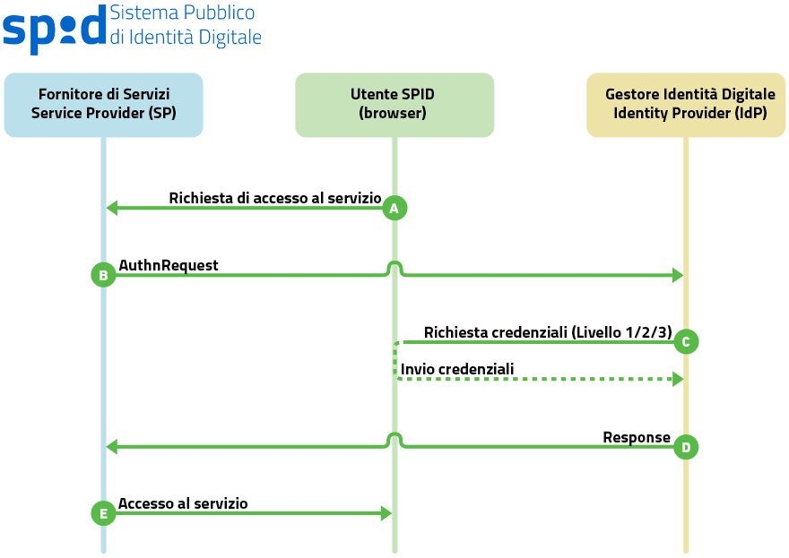

Single Sign-On
==============

Il meccanismo di autenticazione è innescato dalla selezione, da parte dell'utente, del Gestore delle Identità con cui intende effettuare l'accesso; tale selezione avviene all'interno del sito del Fornitore di Servizi mediante un bottone ufficiale "Entra con SPID" da integrarsi nel servizio. Il Fornitore di Servizi prepara di conseguenza una ``<AuthnRequest>`` da inoltrarsi al Gestore delle Identità, dove l'utente viene reindirizzato per effettuare l'autenticazione. Eseguita l'autenticazione, l'utente torna presso il sito del Fornitore di Servizi con un'asserzione firmata dal Gestore delle Identity contenente gli attributi richiesti (ad es. nome, cognome, codice fiscale) che il Fornitore di Servizi può usare per autorizzare l'utente in base alle proprie policy ed erogare il servizio richiesto.

+----+------------------------------------------------------------------------------------------------------------------------------------------------------------------------------------------------------------------------------------------------------------------------+----------------+------------------+
|    |Descrizione                                                                                                                                                                                                                                                             |SAML            |Binding           |
+====+========================================================================================================================================================================================================================================================================+================+==================+
| A  |L'utente richiede l'accesso ad un servizio                                                                                                                                                                                                                              |                |                  |
+----+------------------------------------------------------------------------------------------------------------------------------------------------------------------------------------------------------------------------------------------------------------------------+----------------+------------------+
| B1 |Il Service Provider (SP) invia allo User Agent (UA) una richiesta di autenticazione da far pervenire all'Identity Provider (IdP)                                                                                                                                        |``AuthnRequest``|HTTP POST/REDIRECT|
+----+------------------------------------------------------------------------------------------------------------------------------------------------------------------------------------------------------------------------------------------------------------------------+----------------+------------------+
| B2 |Lo User Agent inoltra la richiesta di autenticazione contattando L'Identity Provider                                                                                                                                                                                    |``AuthnRequest``|HTTP POST/REDIRECT|
+----+------------------------------------------------------------------------------------------------------------------------------------------------------------------------------------------------------------------------------------------------------------------------+----------------+------------------+
| C1 |L'Identity Provider esamina la richiesta ricevuta e, se necessario, esegue una challenge di autenticazione con l'utente                                                                                                                                                 |                |                  |
+----+------------------------------------------------------------------------------------------------------------------------------------------------------------------------------------------------------------------------------------------------------------------------+----------------+------------------+
| C2 |L'Identity Provider, portata a buon fine l'autenticazione, effettua lo user login e prepara l'asserzione contenente lo statement di autenticazione dell'utente destinato al Service Provider (più eventuali statement di attributo emessi dall'Identity Provider stesso)|                |                  |
+----+------------------------------------------------------------------------------------------------------------------------------------------------------------------------------------------------------------------------------------------------------------------------+----------------+------------------+
| D  |L'Identity Provider restituisce allo User Agent la ``<Response>`` SAML contenente l'asserzione preparata al punto precedente                                                                                                                                            |``Response``    |HTTP POST         |
+----+------------------------------------------------------------------------------------------------------------------------------------------------------------------------------------------------------------------------------------------------------------------------+----------------+------------------+
| E  |Lo User Agent inoltra al Service Provider (SP) la ``<Response>`` SAML emessa dall'Identity Provider                                                                                                                                                                     |``Response``    |HTTP POST         |
+----+------------------------------------------------------------------------------------------------------------------------------------------------------------------------------------------------------------------------------------------------------------------------+----------------+------------------+

AuthnRequest
------------
Il messaggio ``AuthnRequest`` è inviato dal Service Provider, per tramite dello User Agent, al SingleSignOnService dell'Identity Provider ed ha la funzione di avviare il flusso di autenticazione. 
Può essere inoltrato da un Service Provider all’Identity Provider usando il binding HTTP-Redirect o il binding HTTP-POST. Il messaggio deve essere conforme allo standard SAML v2.0 (cfr. [SAML-Core]) e rispettare le condizioni di seguito indicate.

.. admonition:: SI DEVE

    * nell'elemento ``<AuthnRequest>`` devono essere presenti i seguenti attributi:

        * l'attributo ``ID`` univoco, per esempio basato su un *Universally Unique Identifier* (UUID) o su una combinazione *origine + timestamp* (quest'ultimo generato con una precisione di almeno un millesimo di secondo per garantire l'univocità)
        * l'attributo ``Version``, che deve valere sempre ``2.0``, coerentemente con la versione della specifica SAML adottata;
        * l'attributo ``IssueInstant`` a indicare l'istante di emissione della richiesta, in formato UTC (esempio: ``2017-03-05T18:03:10.531Z``)
        * l'attributo ``Destination``, a indicare l'indirizzo (URI reference) dell'Identity Provider a cui è inviata la richiesta, come risultante nell'attributo entityID presente nel metadata IdP dell'Identity Provider a cui viene inviata la richiesta
        
            .. WARNING::
                Il valore richiesto per l'attributo ``Destination`` differisce da quanto previsto dalle specifiche SAML.

        
        * l'attributo ``ForceAuthn`` nel caso in cui si richieda livelli di autenticazione superiori a SpidL1 (SpidL2 o SpidL3)
        * l'attributo ``AssertionConsumerServiceIndex``, riportante un indice posizionale facente riferimento ad uno degli elementi ``<AssertionConsumerService>`` presenti nei metadata del Service Provider, atto ad indicare, mediante l'attributo ``Location``, l'URL a cui inviare il messaggio di risposta alla richiesta di autenticazione, e mediante l'attributo ``Binding``, il binding da utilizzare, quest'ultimo valorizzato obbligatoriamente con ``urn:oasis:names:tc:SAML:2.0:bindings:HTTP-POST``. In alternativa all'attributo ``AssertionConsumerServiceIndex`` (scelta sconsigliata) possono essere presenti:

            * l'attributo ``AssertionConsumerServiceURL`` ad indicare l'URL a cui inviare il messaggio di risposta alla richiesta di autenticazione (l'indirizzo deve coincidere con quello del servizio riportato dall'elemento ``<AssertionConsumingService>`` presente nei metadata del Service Provider);
            * l'attributo ``ProtocolBinding``, identificante il binding da utilizzare per inoltrare il messaggio di risposta, valorizzato con ``urn:oasis:names:tc:SAML:2.0:bindings:HTTP-POST``;

    * nell'elemento ``<AuthnRequest>`` non deve essere presente l'attributo ``IsPassive`` (ad indicare ``false`` come valore di default)

    * deve essere presente l'elemento ``<Issuer>`` attualizzato come l'attributo ``entityID`` riportato nel corrispondente SP metadata, a indicare l'identificatore univoco del Service Provider emittente. L'elemento deve riportare gli attributi:

        * ``Format`` fissato al valore ``urn:oasis:names:tc:SAML:2.0:nameid-format:entity``
        * ``NameQualifier`` che qualifica il dominio a cui afferisce tale valore (URI riconducibile al Service Provider stesso)

    * deve essere presente l'elemento ``<NameIDPolicy>`` avente l'attributo:

            * ``Format`` valorizzato come ``urn:oasis:names:tc:SAML:2.0:nameid-format:transient``

    * deve essere presente l'elemento ``<RequestedAuthnContext>`` (SAMLCore, sez. 3.3.2.2.1) ad indicare il contesto di autenticazione atteso, ossia la "robustezza" delle credenziali richieste. Allo scopo sono definite le seguenti *"authentication context class"* estese (SAMLAuthContext, sez. 3) in riferimento SPID:

            * ``https://www.spid.gov.it/SpidL1``
            * ``https://www.spid.gov.it/SpidL2``
            * ``https://www.spid.gov.it/SpidL3``

        referenziate dagli elementi ``<AuthnContextClassRef>``

        Ciascuna di queste classi indica in ordine di preferenza il contesto di autenticazione (atteso o effettivo) secondo alcune dimensioni di riferimento, quali per esempio i meccanismi di autenticazione con cui l'Identity Provider può identificare l'utente. L'elemento ``<RequestedAuthnContext>`` prevede un attributo ``Comparison`` con il quale indicare il metodo per stabilire il rispetto del vincolo sul contesto di abilitazione: i valori ammessi per questo attributo sono:

            * ``exact``
            * ``minimum``
            * ``better``
            * ``maximum``

        Nel caso dell'elemento ``<RequestedAuthnContext>``, questa informazione si riflette sulle tipologie di meccanismi utilizzabili dall'Identity Provider ai fini dell'autenticazione dell'utente. L'esempio seguente di ``<RequestedAuthnContext>`` fa riferimento a una *"authentication context class"* di tipo *SpidL2* o superiore.

        .. literalinclude:: code-samples/requested-authn-context.xml
           :language: xml
           :linenos:

        *N.B. L'Identity Provider ha facoltà di utilizzare per l'autenticazione un livello SPID più alto rispetto a quelli risultanti dall'indicazione del richiedente mediante l'attributo Comparison. Tale scelta non deve comportare un esito negativo della richiesta.*

    * nel caso del binding **HTTP POST** deve essere presente l'elemento ``<Signature>`` contenente la firma sulla richiesta apposta dal Service Provider. La firma deve essere prodotta secondo il profilo specificato per SAML (SAML-Core, cap. 5) utilizzando chiavi RSA almeno a 1024 bit e algoritmo di digest SHA-256 o superiore.

.. admonition:: SI PUÒ

    * nell'elemento ``<AuthnRequest>`` può essere opzionalmente presente l'attributo:

        * ``AttributeConsumingServiceIndex`` riportante un indice posizionale in riferimento alla struttura ``<AttributeConsumingService>`` presente nei metadata del Service Provider, atta a specificare gli attributi che devono essere presenti nell'asserzione prodotta. Nel caso l'attributo fosse assente l'asserzione prodotta non riporterà alcuna attestazione di attributo

    * può essere presente l'elemento ``<Subject>`` a indicare il soggetto per cui si chiede l'autenticazione in cui deve comparire:

        * l'elemento ``<NameID>`` atto a qualificare il soggetto in cui sono presenti i seguenti attributi:

            * ``Format`` che deve assumere il valore ``urn:oasis:names:tc:SAML:2.0:nameid-format:unspecified`` (cfr. SAMLCore, sez. 8.3)
            * ``NameQualifier`` che qualifica il dominio a cui afferisce tale valore (URI)

            .. WARNING::
              L'obbligatorietà dell'attributo ``NameQualifier`` differisce da quanto previsto dalle specifiche SAML.

    * l'elemento ``<Conditions>``, se presente, deve indicare i limiti di validità attesi dell'asserzione ricevuta in risposta, per esempio specificando gli attributi ``NotBefore`` e ``NotOnOrAfter`` opportunamente valorizzati in formato UTC.

        *N.B. L'Identity Provider non è obbligato a tener conto dell'indicazione nel caso che questa non sia confacente con i criteri di sicurezza da esso adottati.*

    * se presente l'elemento ``<Scoping>`` il relativo attributo ``ProxyCount`` deve assumere valore ``0`` per indicare che l'Identity Provider invocato non può delegare il processo di autenticazione ad altra *Asserting Party*.

    * eventuali elementi ``<RequesterID>`` contenuti devono indicare l'URL del servizio di reperimento metadati di ciascuna delle entità che hanno emesso originariamente la richiesta di autenticazione e di quelle che in seguito la hanno propagata, mantenendo l'ordine che indichi la sequenza di propagazione (il primo elemento ``<RequesterID>`` dell'elemento ``<Scoping>`` è relativo all'ultima entità che ha propagato la richiesta).

        Gli elementi ``<Scoping>`` ``<RequesterID>`` sono previsti per futuri usi ed **al momento non devono essere utilizzati.** Nel caso di presenza di tali parametri nella richiesta questi dovranno essere al momento ignorati all’atto dell’elaborazione della risposta da parte dell'Identity Provider.

Esempio di AuthnRequest
^^^^^^^^^^^^^^^^^^^^^^^

.. literalinclude:: code-samples/authnrequest.xml
   :language: xml
   :linenos:

Response
--------

La risposta inviata dall'Identity Provider al Service Provider può essere trasmessa solo tramite il binding HTTP-POST e deve avere le seguenti caratteristiche:

.. admonition:: SI DEVE

    * Nell'elemento ``<Response>`` devono essere presenti i seguenti attributi:

        * l'attributo ``ID`` univoco basato, per esempio, su un Universally Unique Identifier (UUID) (cfr. UUID) o su una combinazione *origine + timestamp* (quest'ultimo generato con una precisione di almeno un millesimo di secondo per garantire l'univocità);
        * deve essere presente l'attributo ``Version``, che deve valere sempre ``2.0``, coerentemente con la versione della specifica SAML adottata;
        * deve essere presente l'attributo ``IssueInstant`` a indicare l'istante di emissione della risposta, in formato UTC;
        * deve essere presente l'attributo ``InResponseTo``, il cui valore deve fare riferimento all'ID della richiesta a cui si risponde;
        * deve essere presente l'attributo ``Destination``, a indicare l'indirizzo (``URI`` reference) del Service Provider a cui è inviata la risposta;

    * Deve essere presente l'elemento ``<Status>`` a indicare l'esito della AuthnRequest secondo quanto definito nelle specifiche SAML (SAML-Core, par. 3.2.2.1 e successivi) comprendente il sotto-elemento

            * ``<StatusCode>``

        ed opzionalmente i sotto-elementi

            * ``<StatusMessage>``
            * ``<StatusDetail>``

        (Messaggi di errore SPID)

    * Deve essere presente l'elemento ``<Issuer>`` a indicare l'entityID dell'entità emittente, cioè l'Identity Provider stesso. L'attributo ``Format`` deve essere omesso o fissato al valore ``urn:oasis:names:tc:SAML:2.0:nameid-format:entity``.
    
    * Deve essere presente un elemento ``<Assertion>`` ad attestare l’avvenuta autenticazione, contenente almeno un elemento ``<AuthnStatement>``; nel caso l’Identity Provider abbia riscontrato un errore nella gestione della richiesta di autenticazione l’elemento ``<Assertion>`` non deve essere presente.

.. admonition:: SI PUÒ

    * Può essere presente l'elemento ``<Signature>`` contenente la firma sulla risposta apposta dall'Identity Provider. La firma deve essere prodotta secondo il profilo specificato per SAML (SAML-Core, cap. 5) utilizzando chiavi RSA almeno a 1024 bit e algoritmo di digest SHA-256 o superiore.

Assertion
^^^^^^^^^

.. admonition:: SI DEVE

    * Nell'elemento ``<Assertion>`` devono essere presenti i seguenti attributi:

        * l'attributo ``ID`` univoco, per esempio basato su un Universally Unique Identifier (UUID) o su una combinazione origine + timestamp  (quest'ultimo generato con una precisione di almeno un millesimo di secondo per garantire l'univocità);
        * l'attributo ``Version``, che deve valere sempre ``2.0``, coerentemente con la  versione della specifica SAML adottata;
        * l'attributo ``IssueInstant`` a indicare l'istante di emissione della richiesta, in formato UTC (esempio: ``2017-03-01T15:05:10.531Z``);

    * Deve essere presente l'elemento ``<Subject>`` a referenziare il soggetto che si è autenticato in cui devono comparire gli elementi:

        * ``<NameID>`` atto a qualificare il soggetto dell'asserzione, in cui sono presenti i seguenti attributi:

        * ``Format`` che deve assumere il valore ``urn:oasis:names:tc:SAML:2.0:nameidformat:transient`` `(SAML Core, par8.3) <https://docs.oasis-open.org/security/saml/v2.0/saml-core-2.0-os.pdf>`_
        * ``NameQualifier`` che qualifica il dominio a cui afferisce tale valore (URI riconducibile all'Identity Provider stesso)

        * ``<SubjectConfirmation>`` contenente l'attributo

            * ``Method`` riportante il valore ``urn:oasis:names:tc:SAML:2.0:cm:bearer``

        * ``<SubjectConfirmationData>`` riportante gli attributi:

            * ``Recipient`` riportante l'``AssertionConsumerServiceURL`` relativa al servizio per cui è stata emessa l'asserzione e l'attributo
            * ``NotOnOrAfter`` che limita la finestra di tempo durante la quale l'asserzione può essere propagata.
            * ``InResponseTo``, il cui valore deve fare riferimento all'ID della richiesta.

    * Deve essere presente l'elemento ``<Issuer>`` a indicare l'entityID dell'Identity Provider emittente (attualizzato come l'attributo ``entityID`` presente nei corrispondenti IdP metadata) con l'attributo ``Format`` riportante il valore ``urn:oasis:names:tc:SAML:2.0:nameidformat:entity``;

    * Deve essere presente l'elemento ``<Conditions>`` in cui devono essere presenti:

        * gli attributi ``NotBefore`` ``NotOnOrAfter``;
        * l'elemento ``<AudienceRestriction>`` riportante a sua volta l'elemento ``<Audience>`` attualizzato con l'entityID del Service Provider per il quale l'asserzione è emessa.

    * Deve essere presente l'elemento ``<AuthStatement>`` a sua volta contenente l'elemento:

        * ``<AuthnContext>`` riportante nel sotto elemento ``<AuthnContextClassRef>`` la classe relativa all'effettivo contesto di autenticazione (es. ``https://www.spid.gov.it/SpidL2``);
        
        Nel caso di asserzioni emesse a seguito di richieste di autenticazione per il livello SPID 1 l’elemento ``<AuthStatement>`` deve avere l'attributo ``SessionIndex`` specificante l'indice della sessione di autenticazione instaurata per l’utente presso il gestore dell’identità; tale elemento non dovrà essere presente nel caso di asserzioni emesse a seguito di richieste di autenticazione per i livelli SPID 2 e SPID 3.
    
    * Deve essere presente l'elemento ``<Signature>`` riportante la firma sull'asserzione apposta dall'Identity Provider emittente. La firma deve essere prodotta secondo il profilo specificato per SAML (cfr [SAML-Core] cap5) utilizzando chiavi RSA almeno a 1024 bit e algoritmo di digest SHA-256 o superiore.

.. admonition:: SI PUÒ

    * Può essere presente l'elemento ``<AttributeStatement>`` riportante gli attributi identificativi certificati dall'Identity Provider. Tale elemento se presente dovrà comprendere:

        * uno o più elementi di tipo ``<Attribute>`` relativi ad attributi che l'Identity Provider può rilasciare (cfr. Tabella attributi SPID) su richiesta del Service Provider espressa attraverso l'attributo ``AttributeConsumingServiceIndex`` quando presente nella AuthnRequest;
        * per gli elementi ``<AttributeValue>`` si raccomanda l'uso dell'attributo ``xsi:type`` attualizzato come specificato nella Tabella attributi SPID;

    * Può essere presente un elemento ``<Advice>``, contenente a sua volta altri elementi ``<Assertion>``. La possibile presenza dell'elemento, prevista per futuri usi, consente, nei casi in cui gli statement emessi dall'Identity Provider si basino su altre asserzioni SAML ottenute da altre authority, di fornire evidenza delle stesse in forma originale unitamente alla risposta alla richiesta di autenticazione.

    *L'elemento* ``<Advice>`` *è previsto per futuri usi ed al momento non deve essere utilizzato.*

Esempio di Response con Assertion
^^^^^^^^^^^^^^^^^^^^^^^^^^^^^^^^^

.. literalinclude:: code-samples/response.xml
   :language: xml
   :linenos:

Processamento della Response
^^^^^^^^^^^^^^^^^^^^^^^^^^^^

Alla ricezione della ``<Response>`` qualunque sia il binding utilizzato il Service Provider prima di utilizzare l'asserzione deve operare almeno le seguenti verifiche:

* controllo delle firme presenti nella ``<Assertion>`` e nella ``<Response>``;
* nell'elemento ``<SubjectConfirmationData>`` verificare che:

    * l'attributo ``Recipient`` coincida con la AssertionConsumerServiceURL a cui la ``<Response>`` è pervenuta
    * l'attributo ``NotOnOrAfter`` non sia scaduto;
    * l'attributo ``InResponseTo`` si riferisca correttamente all'ID della ``<AuthnRequest>`` di richiesta

Il fornitore di servizi deve garantire che le asserzioni non vengano ripresentate, mantenendo il set di identificatori di richiesta (``ID``) usati come per le ``<AuthnRequest>`` per tutta la durata di tempo per cui l'asserzione risulta essere valida in base dell'attributo ``NotOnOrAfter`` dell'elemento ``<SubjectConfirmationData>`` presente nell'asserzione stessa.
